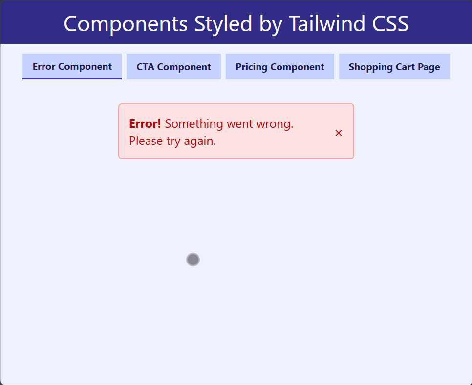

# 🎨 Tailwind Styled Components

A component showcase web page built with **Tailwind CSS utility classes and Vite**.
This project demonstrates reusable UI components styled with Tailwind, including navigation, error messages, call-to-action sections, pricing plans, and a shopping cart page.

---

## 🚀 Live Demo

[View Project](https://himanshu-kumar-2301.github.io/fcc-tailwind-styled-components/)

---

## 🛠️ Tech Stack

- **HTML5** – semantic structure
- **Tailwind CSS** – utility-first styling
- **JavaScript (ES6)** – interactivity (tab navigation, cart logic)
- **Vite** – fast bundler & dev server

---

## 📸 Preview



---

## 📚 Features

- **Component-based design** – modular UI sections for easy reuse.
- **Tailwind CSS styling** – utility-first approach for rapid development.
- **Interactive tab navigation** – powered by JavaScript.
- **Responsive layout** – adapts across desktop and mobile.
- **Shopping cart page** – functional demo for e-commerce workflows.
- **Error message, CTA, and pricing plan components** – ready-to-use building blocks.

---

## 📂 Project Structure

```code
root/
|--public/
|--src/
|  |--style.css
|  |--script.js
|  └──assets/
|     └──screenshot.gif
|--index.html
|--package.json
|--vite.config.js
|--README.md
```

---

## ⚡ Getting Started

1. Clone the repo:

    ```bash
    git clone https://github.com/Himanshu-Kumar-2301/fcc-tailwind-styled-components.git
    ```

2. Navigate into the folder

    ```bash
    cd fcc-tailwind-styled-components
    ```

3. Install dependencies

    ```bash
    npm install
    ```

4. Start the dev server

    ```bash
    npm run dev
    ```

---

## 📌 Future Improvements

- Add dark mode toggle using Tailwind’s theme utilities.
- Expand component library with forms, modals, and dashboards.
- Integrate React or Vue for dynamic component rendering.
- Enhance shopping cart with local storage persistence.

---
